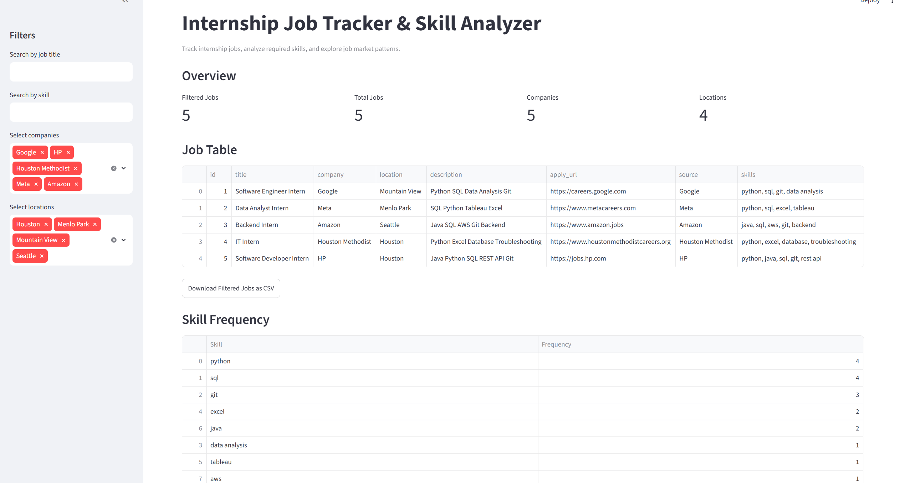
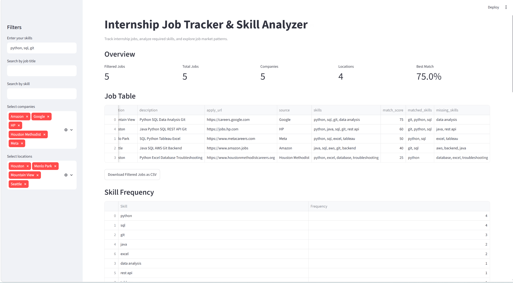

# Internship Job Tracker & Skill Analyzer

A Python-based internship job tracking and skill analysis project.

This project helps users collect internship job data, extract required skills from job descriptions, store job records in a SQLite database, and explore the data through an interactive Streamlit dashboard.

## Features

- Load internship job data from CSV files
- Extract technical skills from job descriptions
- Count skill frequency across job postings
- Store job records in a SQLite database
- Prevent duplicate job records using apply URLs
- Display job data in an interactive Streamlit dashboard
- Filter jobs by title, company, location, and skill
- Visualize top skills and company job counts
- Calculate resume-job match scores based on user skills
- Show matched skills and missing skills for each job
- Download filtered job results as a CSV file

## Tech Stack

- Python
- pandas
- SQLite
- Streamlit
- matplotlib
- Git and GitHub

## Project Structure

```text
internship-job-tracker/
├── app.py
├── analysis.py
├── config.py
├── dashboard.py
├── database.py
├── matcher.py
├── data/
│   └── jobs.csv
├── notes/
│   ├── learning_log.md
│   └── leetcode_log.md
├── screenshots/
│   ├── day9_streamlit_dashboard.png
│   ├── day10_11_dashboard_filters.png
│   └── day12_14_resume_match_score.png
├── requirements.txt
├── .gitignore
└── README.md
```

## Dashboard Preview

### Dashboard Filters and Job Table



### Resume Match Score



## How It Works

The project follows this basic workflow:

```text
CSV Job Data
-> Skill Extraction
-> SQLite Database Storage
-> Streamlit Dashboard
-> Resume Match Score Analysis
```

## Installation

Clone the repository:

```bash
git clone https://github.com/wLuffy004/internship-job-tracker.git
cd internship-job-tracker
```

Install dependencies:

```bash
pip install -r requirements.txt
```

## How to Run

First, run the main app to process job data and update the database:

```bash
python app.py
```

Then launch the Streamlit dashboard:

```bash
streamlit run dashboard.py
```

## Resume Match Score

The dashboard allows users to enter their own skills, such as:

```text
python, sql, git
```

The system compares user skills with each job's required skills and calculates:

- Match score
- Matched skills
- Missing skills

This helps users identify which internship roles are better matches and which skills they should improve.

## Learning Goals

This project was built to practice:

- Python fundamentals
- pandas data processing
- Hash table based skill counting
- SQLite database operations
- Streamlit dashboard development
- Git and GitHub workflow
- Project documentation and portfolio building

## Future Improvements

- Add real internship job scraping
- Add PDF resume parsing
- Add AI-based job recommendation
- Improve dashboard UI
- Add unit tests
- Deploy the dashboard online
