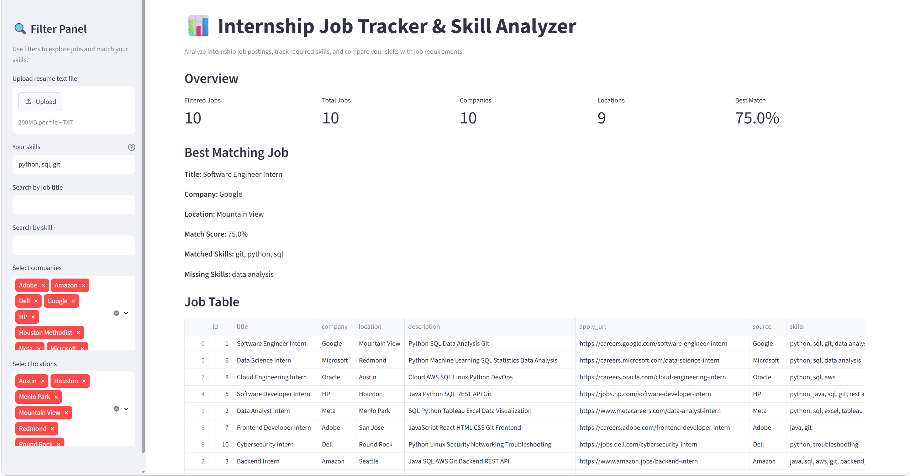
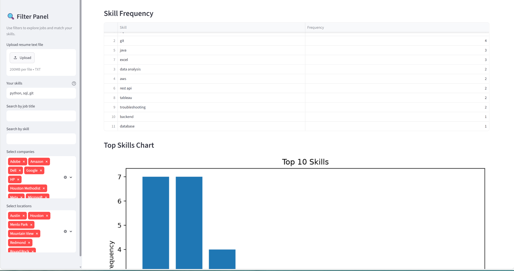
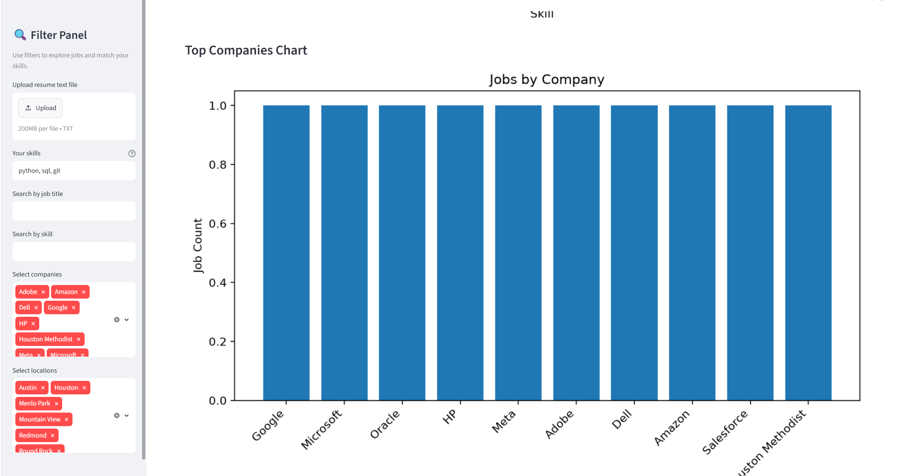
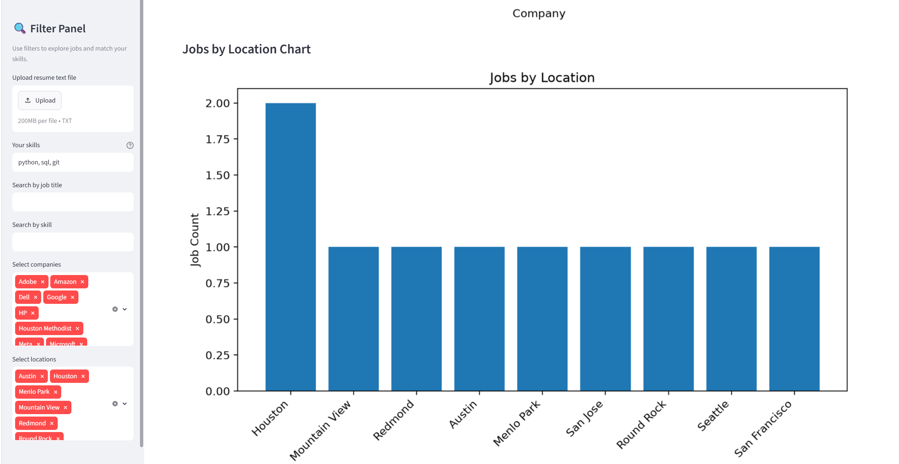

# Internship Job Tracker & Skill Analyzer

An end-to-end internship tracking and skill analysis application built with Python, SQLite, and Streamlit.

It helps internship seekers organize job opportunities, identify in-demand technical skills, evaluate resume-job fit, and explore internship data through an interactive dashboard.

## Live Demo

🚀 **[Open Live Demo](https://internship-job-tracker-fdtpptf275ru5mysxvnkqd.streamlit.app/)**

## Key Features

- Import and manage internship job data
- Extract technical skills from job descriptions
- Store job records in SQLite with duplicate prevention
- Filter jobs by title, company, location, and skill
- Upload a resume and extract technical skills
- Calculate resume-job match scores
- Identify matched and missing skills
- Find the best matching internship opportunities
- Visualize skill demand, companies, and job locations
- Download filtered job results as CSV

---

## Tech Stack

- Python
- pandas
- SQLite
- Streamlit
- matplotlib
- Git & GitHub

---

## Project Structure

```text
internship-job-tracker/
├── app.py
├── analysis.py
├── config.py
├── dashboard.py
├── database.py
├── matcher.py
├── resume_parser.py
├── requirements.txt
├── README.md
├── .gitignore
│
├── data/
│   ├── jobs.csv
│   └── jobs.db  # Generated automatically at runtime
│
├── resumes/
│   └── sample_resume.txt
│
├── screenshots/
│   ├── day21_23_01_dashboard_overview_resume_matching.png
│   ├── day21_23_02_dashboard_skill_frequency_analysis.png
│   ├── day21_23_03_dashboard_company_distribution.png
│   └── day21_23_04_dashboard_location_distribution.png
│
└── notes/
    ├── learning_log.md
    └── leetcode_log.md
```

---

## Dashboard Preview

### Dashboard Overview and Resume Matching



### Skill Frequency Analysis



### Company Distribution



### Location Distribution



---

## How It Works

The project follows this workflow:

```text
CSV Job Data
        │
        ▼
Skill Extraction
        │
        ▼
SQLite Database
        │
        ▼
Resume Upload
        │
        ▼
Resume Skill Extraction
        │
        ▼
Match Score Analysis
        │
        ▼
Interactive Streamlit Dashboard
```

---

## Installation

Clone the repository:

```bash
git clone https://github.com/wLuffy004/internship-job-tracker.git
cd internship-job-tracker
```

Install dependencies:

```bash
pip install -r requirements.txt
```

---

## How to Run

First, process the internship data:

```bash
python app.py
```

Then launch the Streamlit dashboard:

```bash
streamlit run dashboard.py
```

---

## Resume Match Score

Users can either:

- Upload a resume text file (.txt)
- Or manually enter their skills

The dashboard automatically compares user skills with internship requirements and displays:

- Match Score
- Matched Skills
- Missing Skills
- Best Matching Internship

This helps users quickly identify suitable internship opportunities and understand which technical skills should be improved.

---

## Learning Goals

This project was built to practice:

- Python programming
- Data processing with pandas
- Python data structures (Hash Tables, Lists, Sets)
- SQLite database operations
- Streamlit dashboard development
- Resume-job matching
- Git & GitHub workflow
- Software project documentation
- Portfolio project development

---

## Future Improvements

- Support PDF resume parsing
- Add NLP-based resume skill extraction
- Integrate real internship job scraping
- Improve dashboard analytics
- Add unit testing
- Build an AI-powered job recommendation system

---

## Project Status

Portfolio Version 1.0 is feature-complete and currently in maintenance mode.

Future updates will focus on bug fixes, documentation improvements, and deployment stability.
